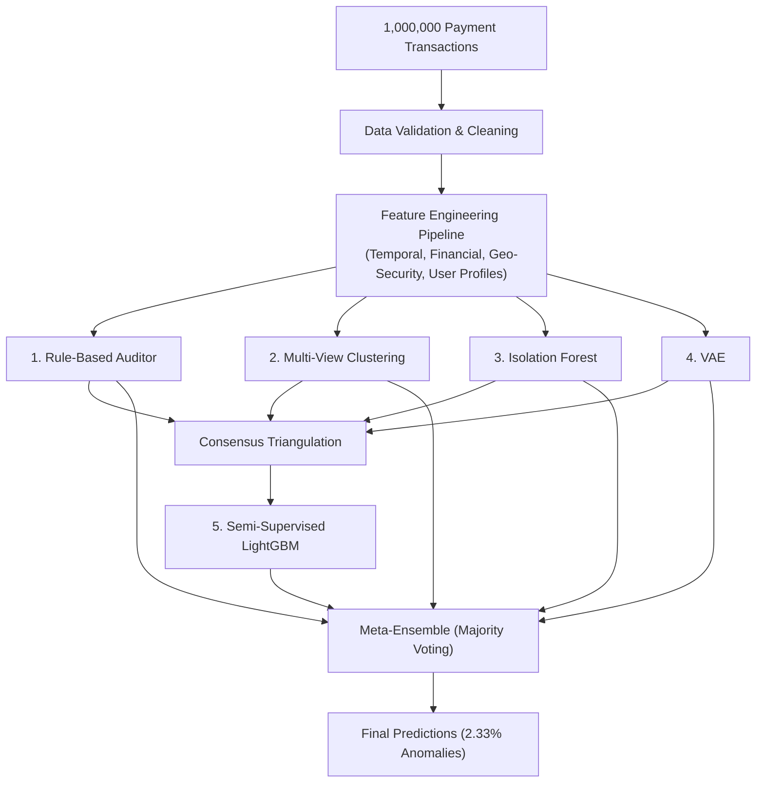

# Payment Anomaly Detection

An experimental framework evaluating and comparing different anomaly detection paradigms on a dataset of 1,000,000 payment transactions.

---

## Overview

In payment processing systems, fraudulent activity, gateway latency spikes, and routing failures are embedded within large transaction streams. Without ground-truth chargeback labels, identifying abnormal transactions requires unsupervised, generative, and semi-supervised techniques.

This repository implements and evaluates five complementary approaches across 1,000,000 payment records:
1. **Rule-Based Auditor**: Deterministic financial, temporal, and gateway invariants.
2. **Multi-View Clustering**: Subspace partitioning via MiniBatchKMeans (Behavioral $k=25$, Technical $k=100$, Latency $k=15$).
3. **Isolation Forest**: Density-based tree isolation.
4. **VAE**: PyTorch Variational Autoencoder with Huber reconstruction loss and $\beta$-annealed KL divergence.
5. **Semi-Supervised LightGBM**: Gradient boosting classifier trained on multi-model consensus pseudo-labels.
6. **Meta-Ensemble**: Majority voting aggregator consolidating predictions across all models.

---

## Architecture and Pipeline



---

## Implemented Approaches

### 1. 9-Layer Rule Auditor
Evaluates transactions against deterministic business and operational invariants:
* **Layer 0 (Integrity):** Negative processing latency ($\Delta t < 0$).
* **Layer 1 (Financial Limits):** Non-positive amounts ($\text{amount} \le 0$) and currency-specific $3\sigma$ IQR outliers.
* **Layer 2 (Processing Delays):** Extreme gateway lag ($\Delta t > 3000\text{ s}$) and PSP Gamma delays ($> 1000\text{ s}$).
* **Layer 3 (Velocity Bursts):** Rapid successive user transactions within 0.1s to 60s.
* **Layer 4 (Geo-Security):** $\text{IP Country} \ne \text{BIN Country}$ on first orders without 3D-Secure authentication.
* **Layer 5 (Compromised Entities):** High-risk bank routing (Bank 777 with 100% failure rate).
* **Layer 6 (Protocol Inconsistencies):** Transactions marked as successful despite active error codes.
* **Layer 7 (Refund Inconsistencies):** Refund amount exceeding original transaction amount, or refunds issued on failed attempts.
* **Layer 8 (Incident Patterns):** Targeted routing incidents (e.g., PSP Beta August 5–9 refund wave; PSP Alpha recurring error 3.08 on amounts $> \$70$).

### 2. Multi-View Clustering (`MiniBatchKMeans`)
Decomposes the feature space into three domain-specific subspaces:
* **Behavioral Subspace ($k = 25$):** User frequency, transaction velocity, and refund tendencies. Anomalies are scored via a weighted toxicity index.
* **Technical Routing Subspace ($k = 100$):** Clustering over payment methods, order types, and gateway configurations to identify failing routes ($\text{fail\_rate} > 60\%$).
* **Latency Subspace ($k = 15$):** Groups transactions by processing duration to isolate extreme delays.

### 3. Density-Based Tree Isolation (`IsolationForest`)
* Employs 300 randomized isolation trees with `contamination="auto"` to isolate sparse data points in high-dimensional continuous space.
* Uses randomized recursive partitioning to assign outlier scores based on path lengths to isolation.

### 4. Deep Generative Modeling (`VAE`)
Implemented in PyTorch for tabular financial data:
* **Architecture:** $D_{\text{in}} \rightarrow 256 \rightarrow 128 \rightarrow 64 \rightarrow z\,(16) \rightarrow 64 \rightarrow 128 \rightarrow 256 \rightarrow D_{\text{out}}$ with LayerNorm, LeakyReLU(0.1), and Dropout(0.2).
* **Numerical Stability:** PerFeatureClipper clamps extreme percentile values to prevent gradient instability.
* **Loss Function:** Huber Reconstruction Loss combined with $\beta$-annealed KL divergence (5 warmup epochs) and $\text{free\_bits} = 0.1$ per latent dimension to prevent posterior collapse.
* **Thresholding:** Adaptive log-normal statistical threshold ($\mu_{\ln} + 1.50\,\sigma_{\ln}$) identifying the natural anomaly tail.

### 5. Consensus Pseudo-Labeling (`LightGBM`)
* **Triangulation:** Samples where $\ge 2$ base models agree are labeled as positive pseudo-labels ($y = 1$), while unanimous non-flagged samples are sampled as clean negatives ($y = 0$). Ambiguous samples are excluded from the training split.
* **Surrogate Classifier:** Stratified 3-Fold LightGBM with early stopping (`patience = 60`, `learning_rate = 0.08`) and class rebalancing learns non-linear decision boundaries.
* **Inference:** High-confidence thresholding ($P \ge 0.98$) ensures that only samples with high tree certainty are marked as anomalous.

### 6. Meta-Ensemble (Majority Voting)
* Aggregates predictions across all individual models.
* A transaction is flagged as an anomaly if and only if at least 3 out of 5 models agree ($\ge 50\%$ vote share).

---

## Discovered Data Patterns

| Pattern / Incident | Target Entity | Empirical Signature | Operational Impact |
| :--- | :--- | :--- | :--- |
| **Bank 777 Outage** | `bank_id == 777` | 100% failure rate across all attempts returning error code `4.09` | Complete transaction rejection on compromised issuer |
| **PSP Beta Refund Storm** | `psp_id == "psp_beta"` | Statistically abnormal refund wave localized between August 5–9, 2025 | Liquidity drain and gateway settlement instability |
| **PSP Alpha Recurring Glitch** | `psp_id == "psp_alpha"` | Recurring orders with $\text{amount} > \$70$ fail systematically with error `3.08` | Automated billing failures on recurring subscriptions |
| **Card Velocity Attacks** | Scripted user sessions | Rapid successive payment attempts within 0.1s–60s lacking 3D-Secure | Automated card testing and credential stuffing |

---

## Comparative Results

### Multi-Model Summary (1,000,000 Transactions)

| Paradigm / Model | Anomaly Count | Anomaly Rate (%) | Total Samples | Primary Detection Focus |
| :--- | :---: | :---: | :---: | :--- |
| **Rule-Based Auditor** | 96,274 | 9.63% | 1,000,000 | Deterministic business & gateway invariant violations |
| **Multi-View Clustering** | 48,942 | 4.89% | 1,000,000 | Systemic group failures & routing cluster defects |
| **Isolation Forest** | 53,824 | 5.38% | 1,000,000 | High-dimensional geometric point outliers |
| **VAE** | 41,838 | 4.18% | 1,000,000 | Non-linear manifold reconstruction errors |
| **Semi-Supervised LightGBM** | 50,833 | 5.08% | 1,000,000 | Non-linear consensus boundary classification |
| **Meta-Ensemble (Voting)** | **23,341** | **2.33%** | 1,000,000 | High-precision multi-model intersection ($\ge 3$ votes) |

### Pairwise Jaccard Similarity Matrix (Anomaly Set IoU)

| Model | Clustering | Isolation Forest | Rule-Based | VAE | Semi-Supervised | Meta-Ensemble |
| :--- | :---: | :---: | :---: | :---: | :---: | :---: |
| **Clustering** | 1.0000 | 0.0258 | 0.2166 | 0.0232 | 0.0257 | 0.0484 |
| **Isolation Forest** | 0.0258 | 1.0000 | 0.0351 | 0.1953 | 0.3271 | 0.3104 |
| **Rule-Based** | 0.2166 | 0.0351 | 1.0000 | 0.0301 | 0.0348 | 0.0501 |
| **VAE** | 0.0232 | 0.1953 | 0.0301 | 1.0000 | 0.7656 | 0.4541 |
| **Semi-Supervised** | 0.0257 | 0.3271 | 0.0348 | 0.7656 | 1.0000 | 0.4335 |
| **Meta-Ensemble** | 0.0484 | 0.3104 | 0.0501 | 0.4541 | 0.4335 | 1.0000 |

### Pairwise Shared Anomaly Counts (Intersection)

| Model | Clustering | Isolation Forest | Rule-Based | VAE | Semi-Supervised | Meta-Ensemble |
| :--- | :---: | :---: | :---: | :---: | :---: | :---: |
| **Clustering** | 48,942 | 2,589 | 25,854 | 2,061 | 2,499 | 3,339 |
| **Isolation Forest** | 2,589 | 53,824 | 5,085 | 15,629 | 25,796 | 18,279 |
| **Rule-Based** | 25,854 | 5,085 | 96,274 | 4,030 | 4,947 | 5,709 |
| **VAE** | 2,061 | 15,629 | 4,030 | 41,838 | 40,185 | 20,356 |
| **Semi-Supervised** | 2,499 | 25,796 | 4,947 | 40,185 | 50,833 | 22,429 |
| **Meta-Ensemble** | 3,339 | 18,279 | 5,709 | 20,356 | 22,429 | 23,341 |

### Analysis of Model Overlap

1. **Strong Anomaly Intersection between VAE and LightGBM ($J = 0.7656$ / 40,185 Shared Anomalies):**
   * Semi-Supervised LightGBM and VAE share 40,185 flagged anomalies out of ~41,800 VAE detections (96.0% recall of VAE predictions), confirming strong alignment between deep generative reconstruction error and gradient boosted tree splits.
2. **Substantial Overlap between Rule-Based Auditor and Clustering ($J = 0.2166$ / 25,854 Shared Anomalies):**
   * Multi-View Clustering and deterministic business rules capture 25,854 overlapping transactions, isolating localized banking and routing incidents.
3. **Orthogonality between Clustering and Density Outliers ($J \approx 0.025$):**
   * Multi-View Clustering isolates systemic density clusters (e.g., Bank 777 failure storms), whereas Isolation Forest and VAE isolate sparse point anomalies. These complementary mechanisms provide orthogonal anomaly coverage.
4. **Ensemble High-Precision Consolidation (23,341 Consensus Anomalies):**
   * The Meta-Ensemble filters out single-model noise, retaining 23,341 transactions supported by majority agreement ($\ge 3$ out of 5 models).

---

## Repository Structure

```text
├── Taskfile.yml                       # Task runner (download, execution, comparison)
├── pyproject.toml                     # Python 3.12 / uv package configuration
├── src/
│   └── paymentguard/                  # Main package
│       ├── core/                      # Base detector abstractions
│       ├── data/                      # Dataset loading and validation
│       ├── features/                  # Leak-free feature transformers
│       ├── models/                    # Rule engine, Clustering, IsoForest, VAE, LGBM, Ensemble
│       ├── evaluation/                # Metrics and terminal comparison tools
│       ├── utils/                     # Logging utilities
│       └── main.py                    # CLI entrypoint
└── README.md                          # Documentation
```

---

## Quickstart

### Setup
```bash
uv sync --all-extras
uv run task download-data
```

### Model Execution

| Model | Command |
| :--- | :--- |
| **Rule-Based Auditor** | `uv run task run-rules` |
| **Multi-View Clustering** | `uv run task run-clustering` |
| **Isolation Forest** | `uv run task run-isoforest` |
| **VAE** | `uv run task run-vae` |
| **Semi-Supervised LightGBM** | `uv run task run-pseudo` |
| **Majority Meta-Ensemble** | `uv run task run-ensemble` |

### Evaluation
```bash
uv run task benchmark
```
